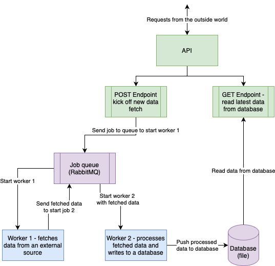

# python-polylith-microservices-example

A demo microservices project in Python using the Polylith architecture and Poetry plugins

## Resources and links on Polylith in Python

- [The Polylith architecture and concepts](https://polylith.gitbook.io/polylith/introduction/polylith-in-a-nutshell)
- [Python setup for Polylith created by David Vujic](https://github.com/DavidVujic/python-polylith)
- [Poetry plugin for Polylith](https://pypi.org/project/poetry-polylith-plugin/)
- [TalkPython podcast episode 'Monorepos' with David Vujic talking about Polylith and Python](https://talkpython.fm/episodes/show/399/monorepos-in-python)

# Tutorial

In exploring how well Polylith might work for Python microservices, I have made extensive step-by-step notes in the form of a tutorial. These notes may help someone else too.

## What will this project do?

It is a simple asynchronous microservices application that includes some elements that are used in a real application. Specifically:

- An asynchronous worker that calls some external service to get some data and posts it to a queue for a data processing worker to pick up
- A second asynchronous worker that takes each fetched data job from the job queue and does some processing and posts results to a database
- An API service on the front of the app with two endpoints
  - A POST endpoint that triggers the kick off of a fetch new data job
  - A GET endpoint that can be used at any time to read the latest data from the database

The architecture and main flow of what will be built is illustrated in the following diagram

## Which libraries will we use to build this?

For the simple API front-end we will create a simple [FastAPI](https://fastapi.tiangolo.com) application to do the job. This would be deployed in its own Docker container

Each of the two **workers** will be simple Python scripts that do the jobs. The two workers will communicate and pass data around by using a [RabbitMQ](https://www.rabbitmq.com) queue and do this using the well-supported Python [pika library](https://pika.readthedocs.io/en/stable/).

Each of the two workers will be deployed to their own Docker containers.
The RabbitMQ queue will be its own standard Docker container.

Finally the database will be a standard Postgres database in it's own Docker container and the API and worker 2 containers will communicate with it.

This may seem overkill for a simple example but splitting into different containers replicates better a real-life situation where you may want to have different workers scaled up or in clusters. It also allows us to explore how well the Polylith architecture will work when we have a lot of containers to orchestrate.

## Tutorial sections

Links to different aspects of the tutorial

- [Getting set up](TUTORIAL_1.md)
- [A development workflow](TUTORIAL_2.md)
- [Creating bricks for our first async worker](TUTORIAL_3A.md)
- [Creating bricks for the other workers](TUTORIAL_3B.md)
- [Creating bricks for the API app](TUTORIAL_4.md)
- [Projects and docker](TUTORIAL_5.md)
- [Testing - not yet done](TUTORIAL_6.md)
