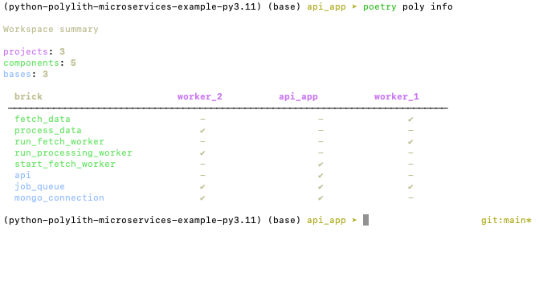

[back to intro](README.md)

# Creating the API app

This part builds a simple FastAPI app with two endpoints that interface with the async workers and also the database.

Our FastAPI app will have two endpoints:

- `GET /` - returns the latest data record
- `POST /refresh` - triggers a fetch of new data in the background

## The api base brick

We can do everything we want within one brick. We will make this a **base** (as it is dealing with the outside world) and call it `api`.

    poetry poly create base --name api

Our code follows standard FastAPI patterns. We import two other bricks: the database connection and the component that can start fetch jobs.

```python
# bases/mousetrap/api/core.py

import fastapi
from mousetrap.mongo_connection import open_db
from mousetrap.start_fetch_worker import start_fetch_job

app = fastapi.FastAPI()


@app.get("/")
def get_latest_data_record() -> dict:
    """Gets the latest processed data record."""

    db = open_db()

    record = db.results.find_one(sort=[("_id", -1)])

    if record:
        # Drop the Mongo ID field
        if "_id" in record:
            del record["_id"]
        return record

    else:
        # Empty database
        return {}


@app.post("/refresh")
def refresh_data() -> dict:
    """Starts a background data refresh job."""

    start_fetch_job()

    return {"status": "ok"}


```

As with the other components, we also need to expose the `app` object in the `__init__.py` file.

And we need to add this base component to the root `pyproject.toml` file.

## Building the Poetry package

We now have all component and base bricks we need.

We now have the following packages in our root `pyproject.toml` file:

```toml
packages = [
    {include = "mousetrap/job_queue", from = "bases"},
    {include = "mousetrap/mongo_connection", from = "bases"},
    {include = "mousetrap/api", from = "bases"},
    {include = "mousetrap/fetch_data", from = "components"},
    {include = "mousetrap/process_data", from = "components"},
    {include = "mousetrap/start_fetch_worker", from = "components"},
    {include = "mousetrap/run_fetch_worker", from = "components"},
    {include = "mousetrap/run_processing_worker", from = "components"},
]
```

## Using the CLI

We can use the CLI to confirm that our bricks seem to be connected correctly by using

    poetry poly info

The output of this is a grid showing the bricks used in the different projects.



Everything looks correct.

---

Next we will assemble the bricks together into `project` bricks that would be deployed as Docker containers in our setup.

[next](TUTORIAL_5.md)
