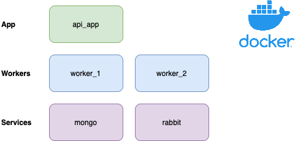
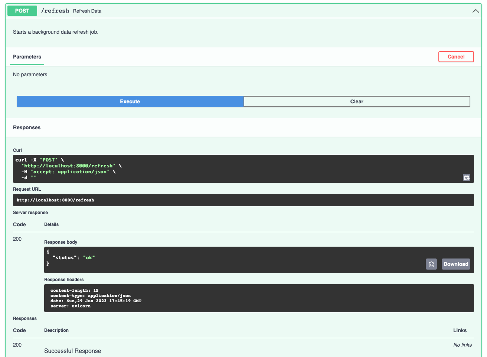
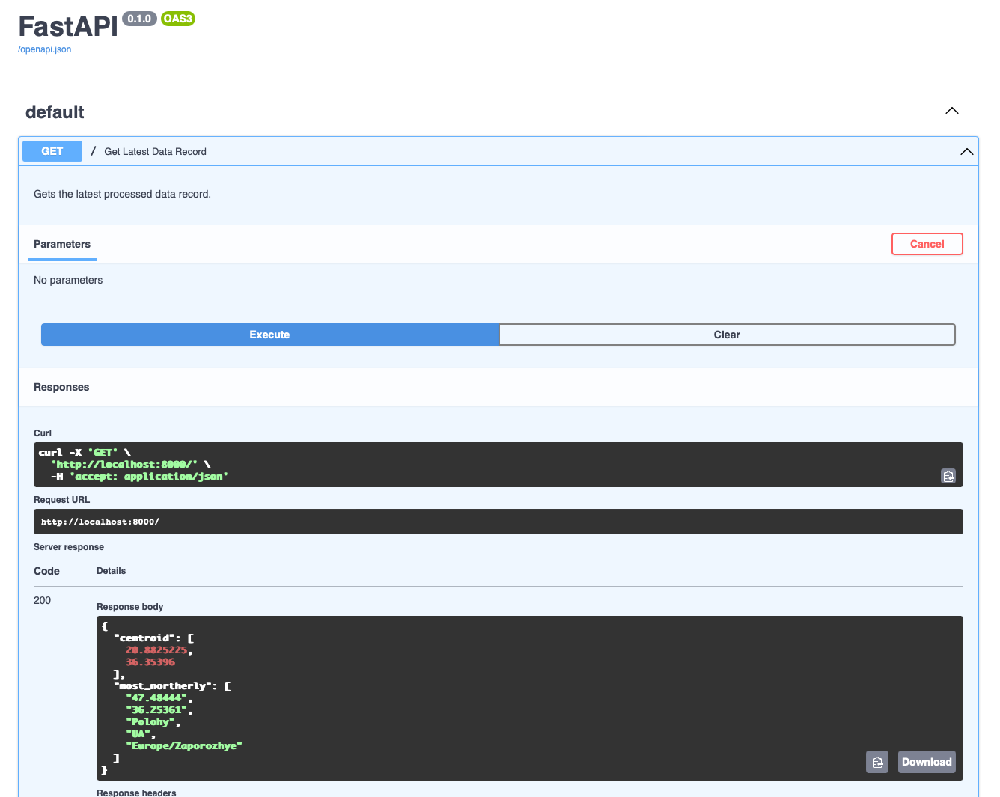

[back to intro](README.md)

# Projects are deployable artefacts

The idea in Polylith is that the `projects` should focus only upon infrastructure and deployment configuration. There is no code in these folders.

In our case we will want to have three different `projects` to be deployed as sepraate containers:

- The API app
- The first worker
- The second worker

The other two components, the queue and the database, are already containerized so we don't need to create projects for these.

## Create our projects

Create the projects for the different deployable artefacts

    poetry poly create project --name worker_1
    poetry poly create project --name worker_2
    poetry poly create project --name api_app

In each project we need to set up the `pyproject.toml` file for the project and then also create a `Dockerfile` to enable us to build images.

### pyproject.toml for a project

The `poetry poly` cli will already have created a draft `pyproject.toml` file for us in the project directory. However we need to add:

- The right bricks for this project need to be specified in the `packages`. Note also that the import paths are now relative.
- The project dependencies from the master `pyproject.toml` need to be included in the `dependencies` section of the project `pyproject.toml` file. No development dependencies are required because `projects` are purely for infrastructure.

In order to build the appropriate packages we can use poetry from within this project directory

    poetry build-project

This will put the created wheel file for this `project` in the local `dist` directory.

### Dockerfile

We can build a `Dockerfile` for each project in the same way as we do normally.

For example, the worker [Dockerfile](projects/worker_1/Dockerfile).

```dockerfile
FROM python:3.11-slim

ARG wheel=worker_1-0.1.0-py3-none-any.whl

WORKDIR /code
COPY ./dist/$wheel /code/$wheel

RUN python -m pip install --upgrade pip
RUN pip install --no-cache-dir /code/$wheel

CMD ["python", "-m", "mousetrap.run_fetch_worker.start"]
```

> In this Dockerfile you can see we use the locally (to the project) created wheel file from poetry.
>
> This is one way of doing this, but it requires making sure a `poetry build-project` is run before the docker image is built and the right name is referenced. This is prone to some errors.
>
> An alternative is to install poetry in the Dockerfile, pass in the pyproject.toml file and build the package in the image. This may be a bit slower but less prone to missing a key step.

We can then build the docker image by running

    docker build . -t mousetrap/worker_1:latest

We should use aa suitable tag for each of the artefacts. I prefer the <namespace>/<project>:<tag> naming for the docker image.

---

## Orchestrating with docker-compose

Once we have created and built all three projects, we are ready to spin up our stack.

Our docker container setup looks like this:



### docker-compose for local development

For our local docker setup we will now add these new images to create a docker-compose file which will spin up all services together.

This local docker-compose file is [deploy/local.yml](deploy/local.yml)

We can spin up the whole stack with

    docker-compose -f deploy/local.yml up

---

## Local user testing

We can now test the API on our local development machine at http://localhost:8000/docs

The GET endpoint initially shows empty data which is correct.

The POST endpoint does seem to call the fetch worker.



A few seconds later the GET endpoint starts to show the latest data



It all seems to work!

---

## Automating the rebuild process

The build of each container requires the poetry package to be built and then the docker image to be built. This needs to be done for each project affected, so to speed up this cycle, a rebuild of all the containers can be triggered from a simple bash script.

An example of this is at [build_projects.sh](build_projects.sh)

> In the future it may be useful to use the `poetry poly` CLI to manage rebuild of projects

---

Our app seems to work as planned. We could create a more secure docker-compose file for a production deployment and move environment variables to a `.env` file.

We haven't written any tests yet, but we could do that next.

[next](TUTORIAL_6.md)
